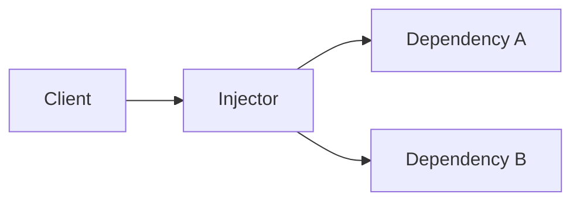
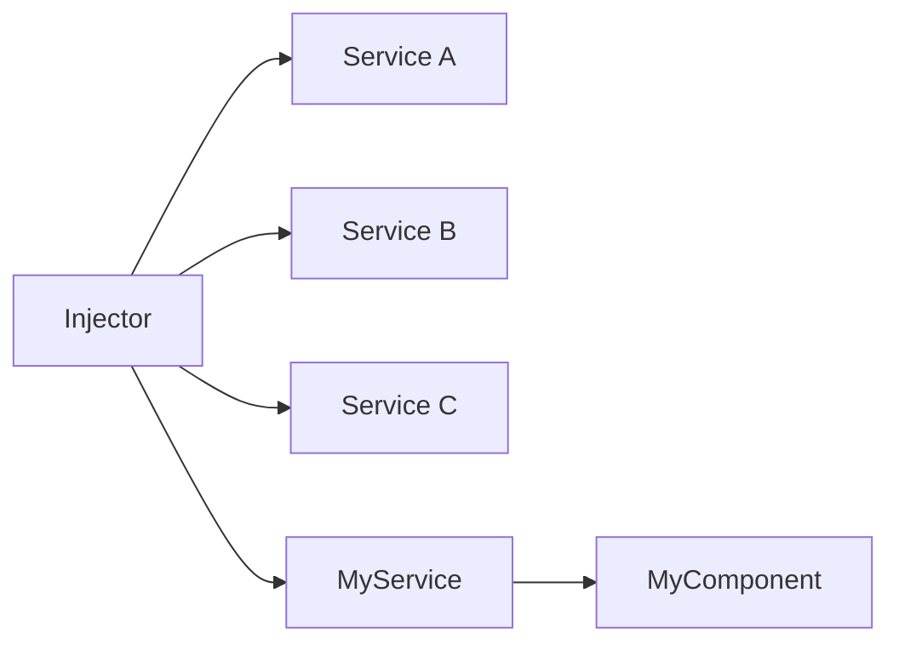

# Assembling the Infinity Gauntlet

## DI and IoC with Decorators in Vanilla JavaScript

Goal: keep DI benefits while staying close to the platform.

<div class="mt-6 text-sm opacity-80">
Lean Web, explicit code paths, standards-first metaprogramming.
</div>

<div class="mt-3 text-sm opacity-80">
The runnable demo uses plain function calls to simulate decorator-applied metadata, so it stays valid JavaScript without depending on <code>@</code> syntax.
</div>

<!--
Speaker notes:
Not a framework war.
Open: "Can we keep DI/IoC benefits and stay close to the platform?"
Theme line: "Can we assemble our own Infinity Gauntlet in Vanilla JavaScript?"
Set expectations: practical, current, runnable.
Timing target: 2:00
Transition cue: "Before we build anything, let us frame the tension that usually pushes teams toward frameworks in the first place."
-->

---
transition: slide-left
---

# Agenda

1. Problem framing: DI value vs framework cost
2. DI and IoC concepts
3. Standards reality: Stage 3 and Stage 1
4. Build: minimal IoC container and decorators
5. Demo: dependency graph resolution
6. Limits, tradeoffs, and adoption path

<!--
Speaker notes:
Roadmap: problem, DI vs IoC, standards, container, live resolution, tradeoffs.
Make the code section feel like the payoff.
Timing target: 1:00
Transition cue: "So let us start from the pain point."
-->

---
layout: two-cols
transition: slide-up
---

# The Tension

Framework DI gives us:

<v-clicks>

- decoupling
- testability
- composability

</v-clicks>

But often adds:

<v-clicks>

- runtime weight
- framework lock-in
- opaque magic

</v-clicks>

::right::

# Lean Web Question

Can we get DI/IoC with:

<v-clicks>

- Vanilla JavaScript
- explicit code paths
- standards-first metaprogramming

</v-clicks>

<!--
Speaker notes:
Core tension.
Benefits: decoupling, testability, composability.
Costs: weight, lock-in, opaque behavior.
Question: how much machinery do we actually need?
Optional personal anecdote here.
Timing target: 3:00
Transition cue: "To answer that, we need to agree on terms first."
-->

---
transition: slide-right
---

# What DI Is

- Dependency Injection means a class receives what it needs from outside.
- The class does not call `new` for its own collaborators.
- That makes behavior easier to test, replace, and reason about.

```js
class UserService {
  constructor(apiClient) {
    this.apiClient = apiClient;
  }
}
```

<!--
Speaker notes:
Keep this plain.
DI = receive collaborators from outside.
Focus on arrival, not the container.
Constructor = honest API.
Timing target: 1:45
Transition cue: "Once dependencies are externalized, the design payoff becomes visible."
-->

---
transition: slide-left
---

# Separation of Concerns

- Classes describe behavior, not assembly.
- Construction and wiring move to a dedicated place.
- This keeps change localized: business logic, composition, and lifecycle can evolve independently.

<!--
Speaker notes:
Behavior here, wiring elsewhere.
Localized change: business logic, composition, lifecycle.
Point: cleaner boundaries.
Timing target: 1:30
Transition cue: "Now DI is one mechanism inside a bigger shift, and that shift is IoC."
-->

---
transition: slide-right
---

# What IoC Is

- Inversion of Control means object creation and wiring move out of the class.
- A composition root or container decides how the graph is assembled.
- Classes focus on behavior while orchestration happens elsewhere.

```js
const userService = new UserService(apiClient);
const app = new App(userService, logger);
```

<!--
Speaker notes:
IoC = control moves outward.
DI = one concrete implementation.
IoC asks who creates; DI asks how collaborators arrive.
Timing target: 1:45
Transition cue: "Once control moves outward, we can name the three main actors."
-->

---
transition: slide-left
---

# The Main Actors



- `Client`: the class that needs collaborators.
- `Dependencies`: the services or resources it consumes.
- `Injector`: the mechanism that provides those dependencies.

<!--
Speaker notes:
Mental model slide.
Client, dependencies, injector.
That is the whole cast.
Timing target: 1:15
Transition cue: "Let us quickly unpack each role so the vocabulary sticks."
-->

---
transition: slide-right
---

# Dependency

- A dependency is any service, helper, or resource another class needs.
- Examples: `Logger`, `ApiClient`, configuration, feature flags.
- In DI, these are supplied explicitly instead of constructed ad hoc.

<!--
Speaker notes:
Dependency = collaborator.
Examples: logger, API client, config.
DI makes dependencies explicit and deliberate.
Timing target: 1:00
Transition cue: "If dependencies are the collaborators, the next question is: who is consuming them?"
-->

---
transition: slide-left
---

# Client

- The client is the class that uses dependencies to do useful work.
- It should express requirements clearly, usually through the constructor.
- It should not know how the dependency graph is built.

```js
class App {
  constructor(userService, logger) {
    this.userService = userService;
    this.logger = logger;
  }
}
```

<!--
Speaker notes:
Client does useful work.
Constructor signatures are documentation.
Client owns behavior, not assembly.
Timing target: 1:10
Transition cue: "And once the client stops owning assembly, someone else has to pick that up."
-->

---
transition: slide-right
---

# Injector

- The injector creates or looks up dependencies and supplies them to the client.
- In simple setups it can be manual wiring.
- In larger systems it is often an IoC container.

```js
const userService = new UserService(apiClient);
const app = new App(userService, logger);
```

<!--
Speaker notes:
Injector picks up assembly.
Small scale: manual wiring.
Larger scale: container.
Container = organized wiring.
Timing target: 1:10
Transition cue: "So what does that look like behind the curtain?"
-->

---
transition: slide-left
---

# Behind the Scenes



- The injector resolves the graph before the client starts doing work.
- The client receives ready-to-use collaborators.
- That is why classes stay focused while composition remains centralized.

<!--
Speaker notes:
Bridge to implementation.
Injector resolves first; client gets ready-to-use collaborators.
This is why classes stay focused.
From here on: one Vanilla JS injector.
Timing target: 1:20
Transition cue: "Now that the mechanics are visible, we can compress DI and IoC into one picture."
-->

---
transition: slide-right
---

# DI vs IoC in One Slide

- DI: dependencies are provided, not constructed internally.
- IoC container: central resolver that controls object creation.
- Result: classes focus on behavior, not wiring.

<div class="mt-4 text-sm opacity-80">
<strong class="stone-soul">Soul Stone</strong>: classes keep their identity and responsibility because wiring lives outside them.
</div>


<!--
Speaker notes:
Summary slide.
DI = provided dependencies.
IoC = centralized creation control.
Soul Stone hook: good DI protects class identity.
Pause on the metaphor.
Timing target: 2:15
Transition cue: "Now that the vocabulary is aligned, let us deal with reality."
-->

---
transition: slide-left
---

# Standards Reality (2026)

- Decorators proposal: **Stage 3**.
- Parameter decorators proposal: **Stage 1**.

Implication:

- We can build a practical approach now using class-level metadata and current tooling.
- Native support is improving, but not every runtime/toolchain supports the same decorator story end to end.
- Constructor-parameter ergonomics are a likely future improvement.
- In this demo, metadata is stored explicitly on the class, so we do not depend on a separate reflection API.

<div class="mt-4 text-sm">
Reference links in abstract:
<br>
<a href="https://github.com/tc39/proposal-decorators" target="_blank" rel="noopener noreferrer"><code>tc39/proposal-decorators</code></a>
and
<a href="https://github.com/tc39/proposal-class-method-parameter-decorators" target="_blank" rel="noopener noreferrer"><code>tc39/proposal-class-method-parameter-decorators</code></a>
</div>

<div class="mt-4 text-sm opacity-80">
<strong class="stone-reality">Reality Stone</strong>: decorators can attach metadata or wrap behavior at definition time.
</div>

<!--
Speaker notes:
Reality Stone slide.
Separate cool theory from safe practice.
Decorators: usable with toolchain.
Parameter decorators: future ergonomics, not foundation.
Timing target: 3:00
Transition cue: "With reality established, we can start assembling the gauntlet for real."
-->

---
transition: slide-up
---

# Container: State and Registration

<<< @/snippets/container-state-slide.js

<div class="mt-4 text-sm opacity-80">
<strong class="stone-power">Power Stone</strong>: the composition root controls creation.
</div>

<!--
Speaker notes:
First container slide.
Show the container as storage before behavior.
providers = recipes, singletons = cached instances.
register() ties a token to a factory and lifecycle.
Power Stone hook: creation power moves into one place.
Timing target: 2:00
Transition cue: "So far we only have storage and registration. The interesting part is how a class gets turned into an object graph."
-->

---
transition: slide-right
---

# Container: `registerClass()`

<<< @/snippets/container-register-class-slide.js

<div class="mt-4 text-sm opacity-80">
<strong class="stone-power">Power Stone</strong>: the composition root decides how a type becomes an instance.
</div>

<!--
Speaker notes:
This is the most important container slide, so it is fine to slow down here.

Suggested explanation:
"This method is the bridge between metadata and object creation. Up to this point, the container only knows that some token exists and that a factory should be called. `registerClass()` raises the abstraction a little bit: instead of manually writing a factory for every class, we say 'here is the class, here are its dependencies, please build the factory for me.'"

"The heart of the method is `deps.map((dep) => container.resolve(dep))`. That line means: before I can construct this type, I need to resolve everything it depends on. And each of those dependencies can trigger the same process again. So this is where the dependency graph becomes a resolution chain."

"In this demo, all classes are registered through `registerClass()` in `main.js`, so every provider ends up following the same pattern. Later, inside `resolve()`, `provider.factory(this)` executes the factory for the current token. That factory then calls `container.resolve(...)` for its dependencies, which causes other factories to run too."

"That is why I describe the behavior as recursive, even though there is no dramatic direct self-call written in one place. `resolve()` runs a factory, that factory resolves dependencies, those dependency resolutions run other factories, and the chain continues until the graph is satisfied."

"Then, once all dependencies are resolved, `new Type(...args)` constructs the actual instance. So conceptually this method says: read the dependency list, resolve the graph, then instantiate the class."

If you want a shorter phrasing on stage:
"`registerClass()` turns metadata into a factory."

Timing target: 3:30
Transition cue: "Now that we can derive factories from dependency metadata, we still need the runtime piece that actually resolves and caches instances."
-->

---
transition: slide-up
---

# Container: `resolve()`

<<< @/snippets/container-resolve-slide.js

<div class="mt-4 text-sm opacity-80">
<strong class="stone-time">Time Stone</strong>: singleton vs transient controls lifetime.
</div>

- This container is intentionally didactic: it shows lookup, lifecycle, and graph resolution clearly, not every capability a production DI framework would need.

<!--
Speaker notes:
Resolution slide.
Walk in order: lookup, missing-provider error, singleton cache, factory invocation.
Time Stone hook: lifetime is a time decision, not just a storage detail.
Good line to say:
"`resolve()` is where lookup, lifecycle, and instantiation finally meet."
Timing target: 2:30
Transition cue: "With the container in place, we can now add the metadata that tells it what each class needs."
-->

---
transition: slide-right
---

# Injectable Decorator

<<< @/demo/decorators.js

- In the runnable demo, we apply decorator logic with ordinary function calls, keeping it valid plain JavaScript.

<div class="mt-4 text-sm opacity-80">
<strong class="stone-mind">Mind Stone</strong>: metadata on the class tells the container what it needs without hardcoding constructor calls.
</div>

<!--
Speaker notes:
Mind Stone slide.
Metadata = knowledge.
Class communicates needs; container reads later.
Declarative intent, explicit runtime.
Still plain JavaScript.
Timing target: 3:00
Transition cue: "Once the container can read intent, we can wire a real service graph."
-->

---
transition: slide-left
---

# Services and Wiring

<<< @/snippets/services-slide.js

<div class="mt-4 text-sm opacity-80">
<strong class="stone-space">Space Stone</strong>: the dependency graph connects services across files and layers without each class having to know the whole universe.
</div>

<!--
Speaker notes:
Space Stone slide.
Graph spans modules and layers.
Focus on `App` and `UserService`.
Say the other services are intentionally simple and not the point right now.
Good line:
"`ApiClient` and `Logger` have straightforward implementations. What matters here is how `App` and `UserService` declare and receive their collaborators."
Then walk the chain: App -> UserService -> ApiClient -> Logger.
Close with: local simplicity, global composition.
Optional line:
"If you want the full implementation, it is in the repo."
Timing target: 3:30
Transition cue: "Now let us actually resolve the graph and see whether the gauntlet snaps into place."
-->

---
transition: slide-up
---

# Live Resolution

<<< @/demo/main.js

<LiveDemo />

<!--
Speaker notes:
Payoff slide.
Register providers, resolve app, graph assembled.
Testing angle: swap implementations in one place.
Pause if demo lands well.
Timing target: 4:00
Transition cue: "At this point we have something useful today, but we can still ask what future ergonomics might improve."
-->

---
transition: slide-right
---

# Experimental Future: Parameter Decorators

This shape is not production-ready today, but shows direction:

<<< @/demo/experimental-parameter-decorators.js

<!--
Speaker notes:
Future ergonomics slide.
Not production guidance.
If parameter decorators mature, metadata gets closer to constructor.
Architecture does not depend on it.
Timing target: 2:00
Transition cue: "Before I close, let me give the honest bill."
-->

---
transition: slide-left
---

# Tradeoffs

- Stage-3 decorators still require build-tool alignment.
- Parameter decorator syntax is proposal-only for now.
- Metadata design is your responsibility in Vanilla JS.
- If you want `@decorator` syntax in production, your toolchain must support the current decorators semantics.
- Benefit: full control, low ceremony, framework-independent architecture.
- AI era point of view: plain JavaScript is easier to inspect, fix, and customize than framework-bound generated code.
- AI-assisted experiments are easier to port into production when the core runtime is platform-native.
- **The Snap**: when proposals and tooling mature, remove compatibility scaffolding and keep the explicit DI core.

<!--
Speaker notes:
Do not oversell.
Costs: toolchain, metadata conventions, immature syntax.
Upside: control, low ceremony, independence.
The Snap hook: scaffolding disappears, core remains.
Decision rule: use this for control and small surface; use frameworks for broader ecosystem needs.
Timing target: 3:30
Transition cue: "So let me close with the smallest practical adoption path."
-->

---
transition: fade
---

# Conclusion

Upcoming ECMAScript features make declarative DI viable with platform-native code.

Start minimal:

1. explicit container
2. lightweight metadata decorators
3. clear boundaries between runtime and experimental syntax

<!--
Speaker notes:
Keep the close practical.
Takeaway: declarative DI is possible with platform-native JS.
Start minimal: one container, light metadata, clear boundaries.
You do not need all six stones on day one.
Timing target: 2:30
-->

---
transition: fade
class: p-0 flex items-center justify-center bg-slate-950
---


<!--
Speaker notes:
Landing slide for final line.
Close: "The platform is more capable than we sometimes assume."
Then: "Thank you."
Pause, smile, Q&A.
Timing target: 0:30
-->
