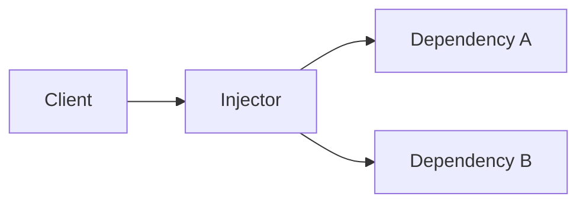
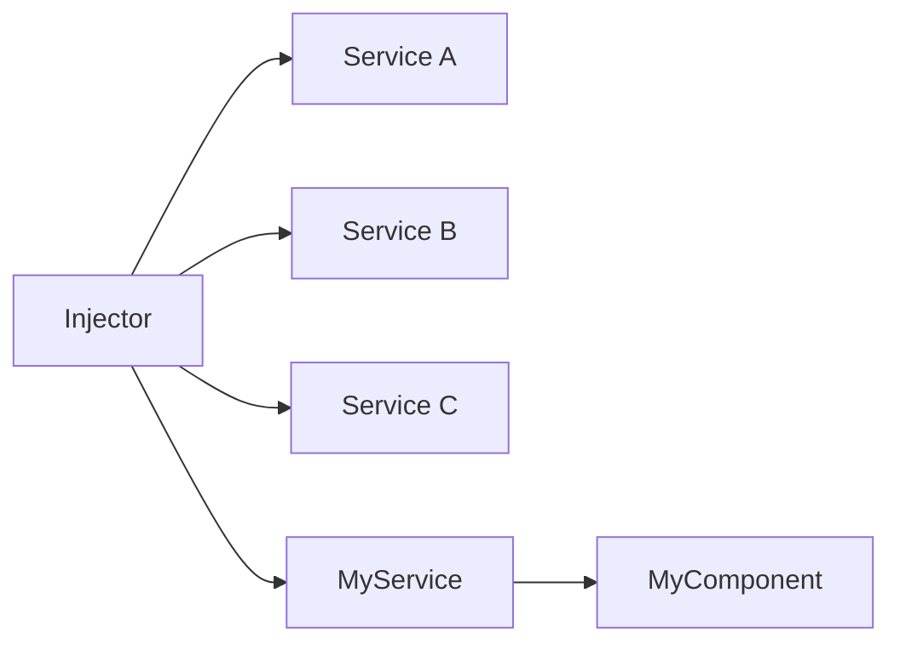
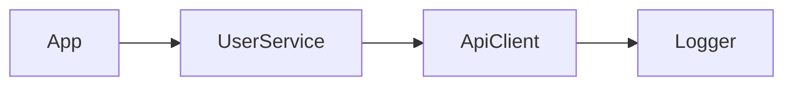

# Assembling the Infinity Gauntlet

## DI and IoC with Decorators in Vanilla JavaScript

Goal: keep DI benefits while staying close to the platform.

<div class="mt-6 text-sm opacity-80">
Lean Web, explicit code paths, standards-first metaprogramming.
</div>

<!--
Talk track:
- Opening statement: this is a practical architecture talk, not framework advocacy.
- Anchor audience expectation: we will build a working IoC container in Vanilla JS.
Timing: 1:00
Transition cue: "First, let us frame why this problem still matters."
-->

---
transition: slide-left
---

# Agenda

1. Problem framing: DI value vs framework cost
2. DI and IoC concepts
3. Standards reality: Stage 3 and Stage 1
4. Build: minimal IoC container and decorators
5. Demo: dependency graph resolution
6. Limits, tradeoffs, and adoption path

<!--
Talk track:
- Set clear path so audience can map each section to one concrete outcome.
Timing: 0:45
Transition cue: "Now the architectural tension."
-->

---
layout: two-cols
transition: slide-up
---

# The Tension

Framework DI gives us:

<v-clicks>

- decoupling
- testability
- composability

</v-clicks>

But often adds:

<v-clicks>

- runtime weight
- framework lock-in
- opaque magic

</v-clicks>

::right::

# Lean Web Question

Can we get DI/IoC with:

<v-clicks>

- Vanilla JavaScript
- explicit code paths
- standards-first metaprogramming

</v-clicks>

<!--
Talk track:
- Contrast capability versus control.
- State target explicitly: not anti-framework, but minimal-first and platform-aligned.
Timing: 2:00
Transition cue: "Quick alignment on DI and IoC terms."
-->

---
transition: slide-right
---

# What DI Is

- Dependency Injection means a class receives what it needs from outside.
- The class does not call `new` for its own collaborators.
- That makes behavior easier to test, replace, and reason about.

```js
class UserService {
  constructor(apiClient) {
    this.apiClient = apiClient;
  }
}
```

<!--
Talk track:
- Keep this one concrete: a class receives collaborators instead of constructing them.
- Emphasize that DI is about how dependencies arrive, not about containers yet.
Timing: 1:10
Transition cue: "The immediate payoff is separation of concerns."
-->

---
transition: slide-left
---

# Separation of Concerns

- Classes describe behavior, not assembly.
- Construction and wiring move to a dedicated place.
- This keeps change localized: business logic, composition, and lifecycle can evolve independently.

<!--
Talk track:
- Connect DI to the software-design payoff, not only the mechanism.
- This also prepares the audience for why containers are useful later.
Timing: 0:55
Transition cue: "DI is one mechanism; the broader control shift is IoC."
-->

---
transition: slide-right
---

# What IoC Is

- Inversion of Control means object creation and wiring move out of the class.
- A composition root or container decides how the graph is assembled.
- Classes focus on behavior while orchestration happens elsewhere.

```js
const userService = new UserService(apiClient);
const app = new App(userService, logger);
```

<!--
Talk track:
- Distinguish IoC from DI: IoC is the broader control shift, DI is one practical mechanism.
- This sets up the container slide without forcing the audience to infer the difference.
Timing: 1:10
Transition cue: "Once that control shifts, we can name the actors involved."
-->

---
transition: slide-left
---

# The Main Actors



- `Client`: the class that needs collaborators.
- `Dependencies`: the services or resources it consumes.
- `Injector`: the mechanism that provides those dependencies.

<!--
Talk track:
- Keep this as the vocabulary slide for the rest of the explanation.
- The point is to make later container code feel familiar, not magical.
Timing: 1:00
Transition cue: "We can unpack each actor quickly."
-->

---
transition: slide-right
---

# Dependency

- A dependency is any service, helper, or resource another class needs.
- Examples: `Logger`, `ApiClient`, configuration, feature flags.
- In DI, these are supplied explicitly instead of constructed ad hoc.

<!--
Talk track:
- Stress that "dependency" is not a special DI term; it is just a collaborator.
- The architectural change is how it arrives.
Timing: 0:45
Transition cue: "Now, who consumes those dependencies?"
-->

---
transition: slide-left
---

# Client

- The client is the class that uses dependencies to do useful work.
- It should express requirements clearly, usually through the constructor.
- It should not know how the dependency graph is built.

```js
class App {
  constructor(userService, logger) {
    this.userService = userService;
    this.logger = logger;
  }
}
```

<!--
Talk track:
- Point out that this class is easy to read because its collaborators are visible.
- The client owns behavior, not assembly rules.
Timing: 0:50
Transition cue: "That leaves one more actor: the injector."
-->

---
transition: slide-right
---

# Injector

- The injector creates or looks up dependencies and supplies them to the client.
- In simple setups it can be manual wiring.
- In larger systems it is often an IoC container.

```js
const userService = new UserService(apiClient);
const app = new App(userService, logger);
```

<!--
Talk track:
- Keep the injector definition broad so it covers both manual composition and containers.
- This helps the audience see the container as an evolution, not a requirement.
Timing: 0:50
Transition cue: "What does that look like behind the scenes?"
-->

---
transition: slide-left
---

# Behind the Scenes



- The injector resolves the graph before the client starts doing work.
- The client receives ready-to-use collaborators.
- That is why classes stay focused while composition remains centralized.

<!--
Talk track:
- This is the bridge from theory into the container implementation that follows.
- Say explicitly: the rest of the talk shows one Vanilla JS way to play the injector role.
Timing: 1:00
Transition cue: "Now we can compare DI and IoC in one picture."
-->

---
transition: slide-right
---

# DI vs IoC in One Slide

- DI: dependencies are provided, not constructed internally.
- IoC container: central resolver that controls object creation.
- Result: classes focus on behavior, not wiring.

<div class="mt-4 text-sm opacity-80">
<strong class="stone-soul">Soul Stone</strong>: classes keep their identity and responsibility because wiring lives outside them.
</div>



<!--
Talk track:
- Keep definitions short, then point to graph as shared language for the rest of the talk.
- Introduce the Soul Stone here: good DI protects service boundaries instead of blurring them.
Timing: 1:30
Transition cue: "With terms aligned, what can standards support today?"
-->

---
transition: slide-left
---

# Standards Reality (2026)

- Decorators proposal: **Stage 3**.
- Parameter decorators proposal: **Stage 1**.

Implication:

- We can build a practical approach now using class-level metadata.
- Constructor-parameter ergonomics are a likely future improvement.
- In this demo, metadata is stored explicitly on the class, so we do not depend on a separate reflection API.

<div class="mt-4 text-sm">
Reference links in abstract:
<br>
<code>tc39/proposal-decorators</code> and <code>tc39/proposal-class-method-parameter-decorators</code>
</div>

<div class="mt-4 text-sm opacity-80">
<strong class="stone-reality">Reality Stone</strong>: decorators can attach metadata or wrap behavior at definition time.
</div>

<!--
Talk track:
- Clarify boundary: production path is Stage 3-capable toolchains.
- Parameter decorators are shown as future direction, not baseline requirement.
Timing: 2:00
Transition cue: "Let us build the minimal container first."
-->

---
transition: slide-up
---

# Minimal Container API

<<< @/snippets/container.js

<div class="mt-4 text-sm opacity-80">
<strong class="stone-power">Power Stone</strong>: the composition root controls creation.
<br>
<strong class="stone-time">Time Stone</strong>: singleton vs transient controls lifetime.
</div>

<!--
Talk track:
- Explain register/resolve lifecycle in 3 passes:
  1) token maps to provider
  2) singleton cache
  3) resolve orchestrates object creation
Timing: 2:30
Transition cue: "Container without metadata is manual wiring; now add decorators."
-->

---
transition: slide-right
---

# Injectable Decorator

<<< @/snippets/decorators.js

- In the runnable demo, we apply decorator logic with ordinary function calls, keeping it valid plain JavaScript.

<div class="mt-4 text-sm opacity-80">
<strong class="stone-mind">Mind Stone</strong>: metadata on the class tells the container what it needs without hardcoding constructor calls.
</div>

<!--
Talk track:
- Decorator stores dependency tokens on the class.
- This keeps wiring declarative while preserving explicit runtime behavior.
Timing: 1:45
Transition cue: "Now apply this to a realistic service chain."
-->

---
transition: slide-left
---

# Services and Wiring

<<< @/snippets/services.js

<div class="mt-4 text-sm opacity-80">
<strong class="stone-space">Space Stone</strong>: the dependency graph connects services across files and layers without each class having to know the whole universe.
</div>

<!--
Talk track:
- Walk one chain: App -> UserService -> ApiClient -> Logger.
- Emphasize that service classes never construct dependencies directly.
Timing: 2:00
Transition cue: "Resolve the graph and verify output."
-->

---
transition: slide-up
---

# Live Resolution

<<< @/snippets/main.js

Try it in the deck:

<LiveDemo />

<!--
Talk track:
- Show registration loop + resolve(App) as the whole composition root.
- Mention this is test-friendly: swap tokens/providers in one place.
Timing: 2:00
Transition cue: "What would parameter decorators improve?"
-->

---
transition: slide-right
---

# Experimental Future: Parameter Decorators

This shape is not production-ready today, but shows direction:

<<< @/demo/experimental-parameter-decorators.js

<!--
Talk track:
- Position as ergonomics layer, not architecture dependency.
- If standardized, constructor injection metadata can be even more local and direct.
Timing: 1:30
Transition cue: "Before closing, clear tradeoffs."
-->

---
transition: slide-left
---

# Tradeoffs

- Stage-3 decorators still require build-tool alignment.
- Parameter decorator syntax is proposal-only for now.
- Metadata design is your responsibility in Vanilla JS.
- If you want `@decorator` syntax in production, your toolchain must support the current decorators semantics.
- Benefit: full control, low ceremony, framework-independent architecture.
- AI era point of view: plain JavaScript is easier to inspect, fix, and customize than framework-bound generated code.
- AI-assisted experiments are easier to port into production when the core runtime is platform-native.
- **The Snap**: when proposals and tooling mature, remove compatibility scaffolding and keep the explicit DI core.

<!--
Talk track:
- Give one decision rule: use this approach when you need control and small surface area.
- Use framework DI when you need broader platform integrations.
- The AI-era angle is not "frameworks are bad"; it is that lower coupling makes generated code easier to evaluate and adapt.
Timing: 1:30
Transition cue: "Close with concrete adoption steps."
-->

---
transition: fade
---

# Conclusion

Upcoming ECMAScript features make declarative DI viable with platform-native code.

Start minimal:

1. explicit container
2. lightweight metadata decorators
3. clear boundaries between runtime and experimental syntax

<div class="mt-6 text-sm opacity-80">
Target duration: about 26-28 minutes including questions.
</div>

<!--
Talk track:
- Restate promise: DI value, platform-first implementation, no hidden magic.
- Invite audience to try the repo and extend the container incrementally.
Timing: 1:00
-->
